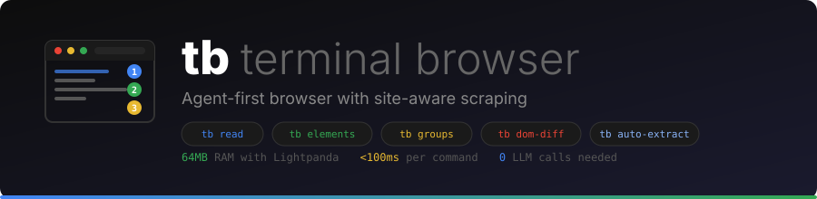
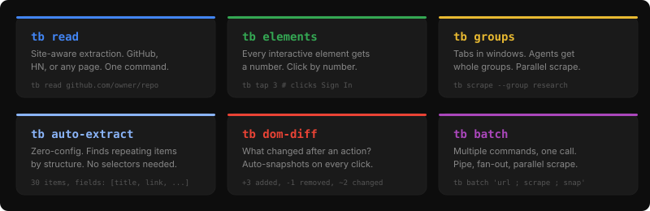
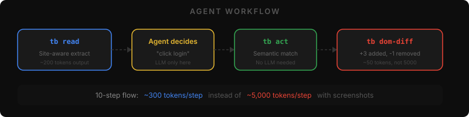
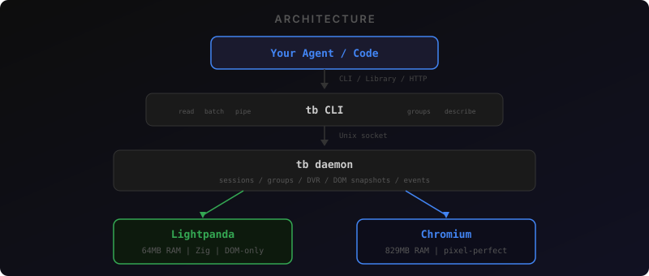

<p align="center">
  
</p>

<p align="center">
  
</p>

```bash
tb read https://github.com/trending              # structured data from any site
tb read https://github.com/owner/repo             # full README + metadata
tb elements && tb tap 3                           # number system — no selectors
tb batch 'url ; scrape ; screenshot /tmp/s.png'   # multi-command, one call
tb scrape --group research                        # hit all tabs at once
```

**64MB RAM** with Lightpanda vs **829MB** with Chrome. Screenshots work on both engines — Lightpanda pairs with the **Blitz render engine** (Firefox's Stylo CSS engine + Taffy layout + a Vello CPU painter, ~18MB binary) to paint pixel-perfect PNGs with no browser. Chromium gives native pixel-perfect capture when you need it.

## The Number System

The core feature for AI agents. Every interactive element on the page gets a stable number. Use the number to click it — no CSS selectors needed.

```bash
tb elements                    # List all interactive elements with numbers
```
```
    1  input   you@example.com
    2  input   Password
    3  button  Sign In
    4  button  Continue with Google
    5  link    Forgot password?
    6  link    Sign Up
```

```bash
tb tap 3                       # Click element #3 (Sign In)
tb tap 1                       # Focus element #1 (email input)
tb type '#email' user@test.com # Type into it
```

`tb annotate` takes a screenshot with floating numbered badges overlaid on each element — same numbers as `tb elements`, but visual. Badges use `position:fixed` + `z-index:999999` so they never disrupt page layout.

```bash
tb annotate ./login.png        # Screenshot with numbered overlays
```

`tb clear` handles React controlled inputs (where `.value = ''` doesn't work):

```bash
tb clear '#email'              # React-compatible clear (dispatches native input event)
tb type '#email' new@value.com # Type fresh
```

## Named Sessions & Viewport Presets

Name sessions so parallel agents don't collide:

```bash
tb open http://app.com/login -e c -n checkout --new   # Named Chromium session
tb --session checkout elements                          # Use by name
tb --session checkout tap 3                             # Click by name
tb ps                                                   # Shows names in list
tb kill checkout                                        # Kill by name
```

Set viewport size with presets or custom dimensions:

```bash
tb -w fhd open <url>           # 1920x1080 (Full HD)
tb -w hd open <url>            # 1280x720
tb -w mac open <url>           # 1440x900 (MacBook Pro)
tb -w air open <url>           # 1470x956 (MacBook Air M2)
tb -w mobile open <url>        # 390x844 (iPhone 14/15)
tb -w ipad open <url>          # 1024x1366 (iPad Pro)
tb -w 1440x900 open <url>     # Custom WxH
```

## Agent Workflow

<p align="center">
  
</p>

The typical flow for an AI agent doing QA or testing:

```bash
# 1. Start a named session with Chromium at full HD
tb stop
tb -w fhd open http://localhost:3000/login -e c -n test --new

# 2. See what's on the page
tb --session test elements

# 3. Fill a login form by number
tb --session test tap 1                            # Focus email
tb --session test type '#email' user@test.com
tb --session test tap 2                            # Focus password
tb --session test type '#password' secret123
tb --session test tap 3                            # Click Sign In

# 4. Wait for redirect, verify
sleep 3
tb --session test url                              # Check URL changed
tb --session test screenshot /tmp/dashboard.png    # Visual verify
tb --session test annotate /tmp/annotated.png      # See what's clickable

# 5. Clean up
tb kill test
```

## Why


Every AI agent needs a browser. The options are all bad:

- **Playwright/Puppeteer**: 684MB Chromium download. 829MB RAM per instance. Cold start 2-5 seconds.
- **Selenium**: Same Chromium problem plus Java.
- **Browser-use/Stagehand**: Wrappers around Chromium. Still 829MB RAM.

`tb` fixes this by using **Lightpanda** (a Zig-based headless browser) as the default engine. Full DOM, JavaScript execution, CDP protocol — at 1/16th the memory. When you need actual pixel screenshots, it can use Chromium too.

## Install

**One command** (installs bun if needed, fetches the source, links `tb` onto your PATH, downloads Lightpanda, builds the Blitz render engine, and runs `tb doctor`):

```bash
curl -fsSL https://raw.githubusercontent.com/hartmantexas/tb/main/install.sh | bash
```

Then verify:

```bash
tb doctor      # shows engines, screenshot quality, and what (if anything) to install next
```

<details>
<summary>Manual install</summary>

```bash
git clone https://github.com/hartmantexas/tb.git
cd tb
bun install
ln -sf "$PWD/bin/tb" ~/.local/bin/tb   # put `tb` on PATH (or: bun link)

tb install lightpanda     # 63MB download, 64MB RAM — default engine
tb install render-engine  # builds Blitz (needs Rust) — pixel-perfect screenshots
tb install chromium       # optional; auto-detects existing Chrome/Brave/Arc/Edge
```
</details>

If you already have Chrome/Brave/Arc installed, `tb` auto-detects them — no extra download needed for the Chromium path.

### For AI agents (Claude & friends)

To set `tb` up in any environment and use it as a browser tool — e.g. *"please get tb from hartmantexas/tb"*:

```bash
# 1. Install (idempotent — safe to re-run)
curl -fsSL https://raw.githubusercontent.com/hartmantexas/tb/main/install.sh | bash
export PATH="$HOME/.local/bin:$PATH"

# 2. Confirm it's ready
tb doctor

# 3. Use it — pixel-perfect screenshots are best at fhd
tb -w fhd open https://example.com
tb screenshot shot.png        # PNG you can read/inspect
tb read https://example.com   # structured text/data, no screenshot needed
tb elements && tb tap 3       # interact by number, no selectors
```

`tb doctor` reports the screenshot quality (PIXEL-PERFECT when the Blitz engine is built) and the exact command to fix anything missing. Building Blitz needs Rust; without it, screenshots still work via an approximation fallback or via Chromium (`-e c`).

## CLI

### Navigation
```bash
tb open http://localhost:3000          # Navigate (starts daemon + engine automatically)
tb open http://example.com --new       # New session
tb open http://api.dev -e c            # Force Chromium (-e lp for Lightpanda)
tb open http://app.com -e c -n mytest  # Named session
tb -w fhd open http://app.com -e c    # Full HD viewport
```

### Screenshots
```bash
tb screenshot                          # Save to /tmp/tb-screenshot-<ts>.png
tb screenshot ./shot.png               # Save to specific path
tb screenshot --open                   # Save and open in Preview
tb screenshot --full-page              # Full page scroll capture
tb screenshot --format jpeg --quality 80
```

Screenshots work on **both engines** (use `-w fhd` for crisp, well-proportioned captures):
- **Chromium**: pixel-perfect via CDP `Page.captureScreenshot`
- **Lightpanda + Blitz**: pixel-perfect via the Stylo/Taffy/Vello render engine — real gradients, grid, flexbox, tables, media-query reflow, at 2× retina, no browser. Falls back to a CSS-cascade approximation if the Blitz binary isn't built.

### Element Interaction (Number System)
```bash
tb elements                            # List numbered interactive elements
tb tap <number>                        # Click element by its number
tb annotate [path]                     # Screenshot with floating number badges
tb clear <selector>                    # Clear input (React-compatible)
```

### Direct Interaction
```bash
tb click "button.submit"               # Click by CSS selector
tb click "#login"                      # Click by ID
tb type "input[name=email]" hello@test.com   # Type into input
tb select "#country" US                # Select dropdown value
tb wait ".loaded"                      # Wait for element to appear
```

### Content Extraction
```bash
tb title                               # Page title
tb url                                 # Current URL
tb text                                # Visible text content
tb content                             # Full HTML
tb eval "document.querySelectorAll('a').length"   # Run JavaScript
tb cookies                             # List cookies
```

### Session Management
```bash
tb ps                                  # List all active sessions (shows names)
tb kill <id-or-name>                   # Kill by session ID or name
tb kill-all                            # Kill all sessions
tb status                              # Daemon status (engines, sessions, uptime)
tb stop                                # Stop daemon + all engines
```

### JSON Mode (for agents)

Every command supports `--json` for structured output:

```bash
tb --json open http://example.com
# {"status":200,"url":"https://example.com/"}

tb --json title
# {"title":"Example Domain"}

tb --json eval "document.links.length"
# {"result":1}

tb --json ps
# [{"id":"abc123","engine":"lightpanda","createdAt":"...","lastUsedAt":"..."}]
```

## Library API

Use `tb` as a Node.js/TypeScript library in your apps:

```typescript
import { tb } from 'tiny-browser'

// Open a page (starts daemon automatically)
const page = await tb.open('http://localhost:3000')

// Read content
console.log(await page.title())     // "My App"
console.log(await page.text())      // visible text
const html = await page.content()   // full HTML

// Interact
await page.click('button.login')
await page.type('#email', 'user@test.com')
await page.waitForSelector('.dashboard')

// Evaluate JavaScript
const count = await page.evaluate<number>('document.images.length')

// Screenshots
const buffer = await page.screenshot({ path: './screenshot.png' })

// Clean up
await page.close()
await tb.stop()
```

### Options

```typescript
const page = await tb.open('http://example.com', {
  engine: 'lightpanda',  // 'lightpanda' | 'chromium' | 'auto'
  width: 1920,
  height: 1080,
})
```

## HTTP API

For language-agnostic integration (Python, Go, Ruby, etc.):

```bash
tb serve 7171
```

```bash
# From any language:
curl -X POST http://localhost:7171/navigate -d '{"url":"http://example.com"}'
curl http://localhost:7171/title
# {"title":"Example Domain"}

curl -X POST http://localhost:7171/click -d '{"selector":"a"}'
curl -X POST http://localhost:7171/screenshot -d '{"path":"/tmp/shot.png"}'
curl -X POST http://localhost:7171/eval -d '{"expression":"1+1"}'
curl http://localhost:7171/text
curl http://localhost:7171/cookies
```

## Architecture

<p align="center">
  
</p>

**Key design decisions:**

- **Daemon pattern**: Browser engines stay warm between commands. First command starts the daemon and engine (~1s). Subsequent commands: <100ms.
- **Engine auto-selection**: `auto` mode picks Lightpanda for everything. If you explicitly use `--engine chromium`, it'll use Chrome.
- **Session isolation**: Each `tb open --new` creates an independent session. Multiple agents can use `tb` concurrently with `--session <id>`.
- **Lean core**: The CLI, daemon, CDP client, and engine management use only bun/node built-ins. Pixel-perfect screenshots come from the standalone **Blitz** binary (Rust); the JS approximation fallback uses takumi/satori + resvg.

## Engines

| Engine | RAM | Screenshot | JS | CSS Rendering | Install Size |
|--------|-----|------------|-----|---------------|-------------|
| **Lightpanda + Blitz** | 64MB | Pixel-perfect (Stylo/Vello) | V8 | Full (Stylo) | 63MB + 18MB |
| **Chromium** | 829MB | Native (pixel-perfect) | V8 | Full | 100-684MB |

**When to use which:**
- **Lightpanda** (default): Scraping, text extraction, form filling, JS evaluation, testing APIs, most agent tasks
- **Chromium**: Visual regression testing, pixel-perfect screenshots, pages that need full CSS rendering

## Concurrent Usage

`tb` is designed for many agents running simultaneously:

```bash
# Agent 1 — named session
tb open http://app.com/page1 -e c -n agent1 --new
# Agent 2 (at the same time)
tb open http://app.com/page2 -e c -n agent2 --new

# Each agent works on their own session by name
tb --session agent1 elements
tb --session agent1 tap 3
tb --session agent2 screenshot ./page2.png
tb --session agent2 annotate ./page2-annotated.png

# See everything running
tb ps
# ID         NAME             ENGINE       CREATED        LAST USED
# abc123     agent1           chromium     2m ago         just now
# def456     agent2           chromium     1m ago         just now

# Clean up by name
tb kill agent1
tb kill agent2
```

## Smart Reading & Scraping

`tb read` is site-aware extraction in one command. No selectors, no configuration.

```bash
# GitHub repo — full README + metadata
tb read https://github.com/D4Vinci/Scrapling
# → ## D4Vinci/Scrapling
# → Stars: 56.7k  Forks: 5.5k  Lang: Python
# → (full README text)

# Multiple repos at once (one tab, sequential)
tb read https://github.com/D4Vinci/Scrapling https://github.com/microsoft/markitdown https://github.com/anthropics/claude-code

# GitHub trending
tb read https://github.com/trending
# → 15 repos with name, language, stars, description

# Trending + follow top 5 for full READMEs
tb read https://github.com/trending --follow 5

# Hacker News
tb read https://news.ycombinator.com
# → 30 stories with title, URL, points, comments

# Any page — smart extraction
tb read https://example.com

# JSON for pipelines
tb read https://github.com/trending --json
```

### Other Scraping Commands

```bash
tb describe                        # Page type detection (form/list/table/article)
tb auto-extract                    # Zero-config: finds repeating items automatically
tb find-similar ".product"         # Find all structurally similar elements
tb scrape                          # Reader-mode content extraction
tb extract '{"titles":"h3"}'       # Extract by CSS selector schema
```

### Batch & Parallel

```bash
# Multiple commands, one call
tb batch 'url ; title ; scrape ; screenshot /tmp/s.png' --json

# Fan-out: extract links, open each as tab, scrape all
tb pipe --links "a.story" --group stories --then scrape --limit 5
```

## Groups (Windows & Tabs)

Sessions are tabs. Groups are windows. Agents get whole groups.

```bash
# Create sessions in groups
tb open https://github.com/a -n repoA --group research --new
tb open https://github.com/b -n repoB --group research --new

# View and manage
tb groups                          # Quick overview
tb move repoA --group other        # Move tab between windows
tb group rename research dev       # Rename group

# Group-level commands — ALL tabs at once
tb url --group research
tb scrape --group research
tb screenshot --group research
tb eval "document.title" --group research

# Watch a group
tb watch --group research          # Focused window with group tabs only
tb cc                              # Command center (grid of all windows)
```

## Semantic Interaction

```bash
tb snapshot -i                     # Accessibility tree with @e refs
tb act "click sign in"             # Natural language action (no LLM, semantic match)
tb tap-ref @e3                     # Click by ref
tb chat "What is X?"               # Send message to AI on page, wait for response
```

## DOM Diffing

Auto-snapshots on every navigation and click. See what changed:

```bash
tb dom-snapshot                    # Manual snapshot
tb dom-diff                        # Structural diff vs previous
# → +3 added (form, input#email, input#password)
# → -1 removed (div.welcome)
# → ~2 changed (nav.active, #cart: "0" → "1")
```

## Network Interception

```bash
tb intercept block "*.ads.*"                     # Block URL patterns
tb intercept mock "/api/test" '{"status":"ok"}'  # Mock API responses
tb intercept capture                             # View captured requests
```

## Recording & Replay

```bash
tb record my-flow --session x      # Record actions (Ctrl+C to stop)
tb replay my-flow --session x      # Replay
tb auth save github --session x    # Save cookies + localStorage
tb auth load github --session x    # Restore into any session
```

## DVR & Events

```bash
tb history                         # Action log with timestamps
tb history --since 60              # Last 60 seconds
tb events                          # Live console, navigation, network errors
```

## Configuration

```bash
# Config file: ~/.tb/config.json
{
  "defaultEngine": "auto",
  "viewport": { "width": 1280, "height": 720 },
  "daemonTimeout": 1800000,
  "screenshotDir": "/tmp"
}
```

## File Structure

```
~/.tb/
├── config.json          # Configuration
├── daemon.sock          # Unix socket (daemon IPC)
├── daemon.pid           # Daemon process ID
├── engines/
│   ├── lightpanda       # Lightpanda binary
│   └── chromium/        # Chrome headless shell
└── fonts/               # Custom fonts for the fallback renderer
    └── *.ttf            # Place .ttf files here
```

## License

MIT
